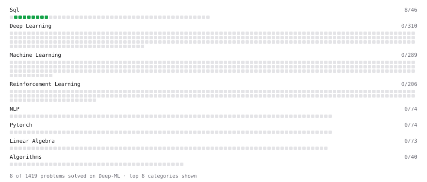

# Deep-ML

My machine learning practice from [Deep-ML](https://www.deep-ml.com). Every solution here was written by hand.

**5** solved · 5 problems · 0 labs · 0 math

[**Browse the interactive portfolio**](https://shivanishukla20.github.io/deep-ml/) to replay this filling in over time.

## Problems

| | Difficulty | Solved | |
| --- | --- | --- | --- |
| [Filter rows with WHERE](https://www.deep-ml.com/problems/1103) | easy | 2026-09-17 | [solution](problems/1103-filter-rows-with-where) |
| [Remove duplicates with DISTINCT](https://www.deep-ml.com/problems/1105) | easy | 2026-09-17 | [solution](problems/1105-remove-duplicates-with-distinct) |
| [Select specific columns](https://www.deep-ml.com/problems/1102) | easy | 2026-09-17 | [solution](problems/1102-select-specific-columns) |
| [Sort results with ORDER BY](https://www.deep-ml.com/problems/1104) | easy | 2026-09-17 | [solution](problems/1104-sort-results-with-order-by) |
| [Top N with LIMIT](https://www.deep-ml.com/problems/1106) | easy | 2026-09-17 | [solution](problems/1106-top-n-with-limit) |

---

_This file is regenerated by Deep-ML on every push._
